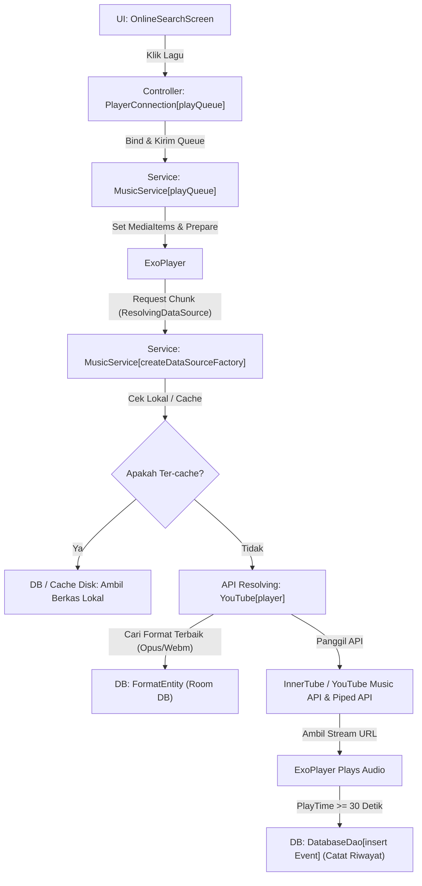
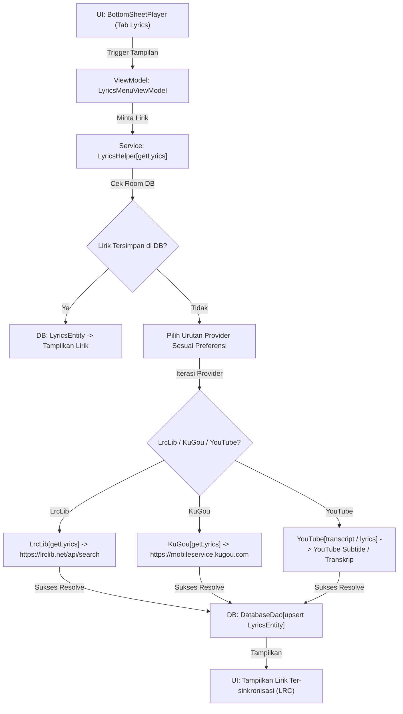

# SYSTEM_MAP.md

Peta navigasi utama dan dokumentasi arsitektur sistem proyek **Muzza**.

---

# Project Summary

- **Tujuan Aplikasi**: Muzza adalah aplikasi pemutar musik Android premium, standalone, dan open-source yang memungkinkan pengguna untuk mencari, streaming, mengunduh, dan mengorganisasi musik secara langsung menggunakan API YouTube Music (InnerTube), lengkap dengan sinkronisasi lirik dinamis dari berbagai penyedia (LrcLib, KuGou, YouTube Subtitle).
- **Tech Stack Utama**:
  - **Runtime & Platform**: Android (Java 17 / Kotlin, Min SDK 24, Target SDK 34)
  - **UI Framework**: Jetpack Compose dengan Material Design 3 (M3)
  - **Dependency Injection**: Dagger Hilt
  - **Asynchronous & Flow**: Kotlin Coroutines & StateFlow / SharedFlow
  - **Media & Audio Player**: Jetpack Media3 (ExoPlayer & MediaSession)
  - **Local Database**: Room DB (dengan auto-migration)
  - **Local Settings / Preferences**: Android Jetpack DataStore
  - **Network Client**: Ktor HttpClient dengan engine OkHttp & CIO
  - **Image Loader**: Coil (dengan kustomisasi disk cache)
- **Pola Arsitektur**: MVVM (Model-View-ViewModel) modular yang dipadukan dengan arsitektur Event-Driven untuk status pemutaran latar belakang melalui Media3 Service.

---

# Core Logic Flow (Function-Level Flowchart)

Berikut adalah dua alur logika kritis di dalam sistem Muzza yang menggerakkan pemutaran audio dan sinkronisasi lirik:

### 1. Alur Pencarian & Pemutaran Musik (Resolusi Stream)



**Format Alur Teks Lintasan**:
`OnlineSearchScreen (Klik Song) -> PlayerConnection[playQueue] -> MusicService[playQueue -> ResolvingDataSource] -> YouTube[player] -> InnerTube API / Piped API (URL stream) -> MusicDatabase[insert Event / FormatEntity]`

---

### 2. Alur Sinkronisasi Lirik Dinamis (Lyrics Fetching)



**Format Alur Teks Lintasan**:
`BottomSheetPlayer -> LyricsMenuViewModel -> LyricsHelper[getLyrics] -> LrcLib / KuGou / YouTube Provider -> MusicDatabase[upsert LyricsEntity] -> UI Lyrics`

---

# Clean Tree

Berikut adalah struktur kode sumber bersih yang diurutkan secara ringkas sesuai aturan pengecualian (tanpa cache, build, .git, .gradle, dan berkas sampah lainnya):

```
d:/ui/Muzza-master/
├── app/ (Modul Utama Aplikasi)
│   ├── build.gradle.kts
│   └── src/main/
│       ├── AndroidManifest.xml
│       └── java/com/maloy/muzza/
│           ├── App.kt (Entrypoint Application)
│           ├── MainActivity.kt (Entrypoint Host Activity, Jetpack Compose Navigation)
│           ├── constants/ (Definisi Kunci Preferences & Konstanta Media)
│           ├── db/ (Arsitektur SQLite & Room)
│           │   ├── Converters.kt
│           │   ├── DatabaseDao.kt
│           │   ├── MusicDatabase.kt
│           │   └── entities/ (Entitas Room DB)
│           ├── di/ (Hilt Dependency Injection Modules)
│           ├── extensions/ (Helper Kotlin, Flow, Bitmap, Ktor extensions)
│           ├── lyrics/ (Mesin Resolusi Lirik)
│           │   ├── KuGouLyricsProvider.kt
│           │   ├── LrcLibLyricsProvider.kt
│           │   ├── LyricsHelper.kt
│           │   ├── LyricsProvider.kt
│           │   ├── YouTubeLyricsProvider.kt
│           │   └── YouTubeSubtitleLyricsProvider.kt
│           ├── models/ (Data Transfer Objects & UI Models)
│           ├── playback/ (Logika Pemutaran Latar Belakang Media3)
│           │   ├── DownloadUtil.kt
│           │   ├── ExoDownloadService.kt
│           │   ├── MediaLibrarySessionCallback.kt
│           │   ├── MusicService.kt
│           │   ├── PlayerConnection.kt
│           │   └── queues/ (YouTubeQueue, ListQueue, EmptyQueue)
│           ├── ui/ (Sistem Tampilan Jetpack Compose)
│           │   ├── component/
│           │   ├── menu/
│           │   ├── player/ (BottomSheetPlayer & Panel Kontrol)
│           │   ├── screens/ (HomeScreen, StatsScreen, HistoryScreen, Settings, dll)
│           │   └── theme/ (Skema Tema Dinamis M3)
│           ├── utils/ (Utilitas DataStore, Logging)
│           ├── viewmodels/ (State Controller Per Screen)
│           └── widget/ (Home Screen Widgets)
├── innertube/ (Modul Wrapper API YouTube Music)
│   ├── build.gradle.kts
│   └── src/main/java/com/maloy/innertube/
│       ├── InnerTube.kt (Ktor HTTP Client, Autentikasi SAPISIDHASH)
│       ├── YouTube.kt (Fungsi Parsers, Search, Album, Playlist, Artist, Player)
│       ├── encoder/
│       ├── models/ (Struktur JSON Data & Parser Models)
│       └── pages/ (Kode Pemilah Dokumen / Scraping Parser)
├── kugou/ (Modul Wrapper API Lirik KuGou)
│   ├── build.gradle.kts
│   └── src/main/java/com/maloy/kugou/
│       └── KuGou.kt (Ktor client & decoder Base64 LRC KuGou)
├── lrclib/ (Modul Wrapper API Lirik LrcLib)
│   ├── build.gradle.kts
│   └── src/main/java/com/maloy/lrclib/
│       └── LrcLib.kt (Ktor client untuk pencarian lirik ter-sinkronisasi)
└── material-color-utilities/ (Utilitas Ekstraksi Warna Google M3)
```

---

# Module Map (The Chapters)

### 1. Modul `:app` (Aplikasi Utama)

| Path / File | Fungsi / Class Utama | Deskripsi Peran Modul |
| :--- | :--- | :--- |
| `App.kt` | `App` | Menyetel locale YouTube, menginisialisasi setelan proxy dinamis, mengumpulkan data cookie, dan mengonfigurasi Coil cache. |
| `MainActivity.kt` | `MainActivity` | Menangani perutean layar (Jetpack Compose NavHost), skema tema dinamis dari cover album, deep link, dan penanganan search bar. |
| `db/MusicDatabase.kt` | `MusicDatabase`, `InternalDatabase` | Mendefinisikan database Room versi 14 beserta spesifikasi migrasi otomatis (AutoMigrations 1-14). |
| `db/DatabaseDao.kt` | `DatabaseDao` | Berisi semua query SQLite untuk penyimpanan lagu, album, artist, riwayat pencarian, penambahan jumlah dengar, dan statistik. |
| `lyrics/LyricsHelper.kt` | `LyricsHelper` | Mengelola pemanggilan lirik secara berjenjang dari LrcLib, KuGou, hingga YouTube Subtitle berdasarkan preferensi pengguna. |
| `playback/MusicService.kt` | `MusicService` | Layanan latar belakang pemutar musik berbasis Jetpack Media3 ExoPlayer yang mengelola resolusi streaming URL dari YouTube secara on-the-fly. |
| `playback/PlayerConnection.kt`| `PlayerConnection` | Jembatan kontrol yang menghubungkan state UI Jetpack Compose dengan `MusicService` pemutar musik latar belakang. |
| `viewmodels/HomeViewModel.kt` | `HomeViewModel` | Memuat rekomendasi beranda berdasarkan kebiasaan putar lokal (database) dan feed global dari YouTube Music (`YouTube.home()`). |

### 2. Modul `:innertube` (API Client YouTube Music)

| Path / File | Fungsi / Class Utama | Deskripsi Peran Modul |
| :--- | :--- | :--- |
| `InnerTube.kt` | `InnerTube` | Mengelola Ktor HTTP Client untuk request POST/GET ke endpoint `youtubei/v1`, lengkap dengan kalkulasi SAPISIDHASH untuk otorisasi login. |
| `YouTube.kt` | `YouTube` (Singleton) | Menyediakan API tingkat tinggi untuk mencari lagu/album/playlist, merekomendasikan musik, dan mengekstrak streaming audio formats. |

### 3. Modul `:kugou` & `:lrclib` (Penyedia Lirik Eksternal)

| Path / File | Fungsi / Class Utama | Deskripsi Peran Modul |
| :--- | :--- | :--- |
| `KuGou.kt` | `KuGou` (Singleton) | Melakukan lookup ke API pencarian lagu KuGou, mengunduh file lirik base64-encoded, dan menormalkannya dari metadata sampah. |
| `LrcLib.kt` | `LrcLib` (Singleton) | Menjalankan pencarian lirik tersinkronisasi di platform `lrclib.net` berdasarkan kecocokan meta-data durasi dan nama artis. |

---

# Data & Config

- **Lokasi Config Utama**:
  - `gradle.properties`: Berisi konfigurasi kompilasi JVM, setelan memori Gradle daemon.
  - `app/build.gradle.kts` & `build.gradle.kts`: Berisi target SDK (34), versi aplikasi (0.5.7), pustaka desugaring, setelan produk flavor (`full` vs `foss`), dan dependensi modular.
  - `app/src/main/java/com/maloy/muzza/constants/`: Menyimpan semua kunci preferences Android DataStore (seperti `DarkModeKey`, `PureBlackKey`, `ProxyEnabledKey`, dll).
- **Skema Data Singkat (Room Database - `song.db`)**:
  - `SongEntity` / `Song`: Tabel penyimpan metadata lagu (id, title, duration, thumbnailUrl, albumId, albumName, liked, totalPlayTime).
  - `ArtistEntity` / `Artist`: Penyimpan metadata artis (id, name, thumbnailUrl).
  - `AlbumEntity` / `Album`: Penyimpan metadata album (id, title, year, thumbnailUrl, songCount).
  - `PlaylistEntity` / `Playlist`: Tabel playlist lokal buatan pengguna.
  - `LyricsEntity`: Cache lokal untuk teks lirik lagu yang sudah berhasil ter-resolve (id, lyrics).
  - `FormatEntity`: Informasi format audio streaming yang sedang/pernah dimainkan (itag, mimeType, codecs, bitrate, sampleRate, contentLength, loudnessDb).
  - `Event`: Tabel log riwayat mendengar (songId, timestamp, playTime) untuk kebutuhan statistik grafik di `StatsScreen`.
  - **Relasi Pemetaan (Mapping Tables)**: `SongArtistMap`, `SongAlbumMap`, `AlbumArtistMap`, `PlaylistSongMap`, `RelatedSongMap` yang menyusun relasi Many-to-Many di SQLite.
- **Lokasi Migration / Seed**:
  - Terpusat di [MusicDatabase.kt](file:///d:/ui/Muzza-master/app/src/main/java/com/maloy/muzza/db/MusicDatabase.kt#L63-L364). Menyertakan skrip SQLite manual untuk `MIGRATION_1_2` dan migrasi skema deklaratif otomatis (`AutoMigration` dari versi 2 hingga 14).
- **Folder Output / Runtime Artifacts**:
  - Folder Cache Coil: `cacheDir/coil` (diatur dinamis via dataStore preferensi `MaxImageCacheSizeKey`).
  - File Queue Terakhir: `filesDir/persistent_queue.data` (disimpan menggunakan `ObjectOutputStream` biner secara periodik).
  - Berkas Unduhan Musik: Dikelola oleh `ExoDownloadService` dan diatur secara transparan di dalam direktori internal cache Android.

---

# External Integrations

Muzza terintegrasi langsung dengan beberapa API/Layanan eksternal berikut tanpa memerlukan perantara backend PC:
1. **Google YouTube Music InnerTube API (`https://music.youtube.com/youtubei/v1/`)**: Endpoint utama pencarian musik, browse album, playlist, rekomendasi beranda, dan resolusi streaming video (Muzza menggunakan Client `ANDROID_MUSIC`, `WEB_REMIX`, dan `TVHTML5`).
2. **Piped API (`https://pipedapi.kavin.rocks/streams/{videoId}`)**: Dipanggil sebagai fallback oleh `YouTube.player` untuk mendapatkan cadangan streaming link apabila format stream langsung dari YouTube dibatasi tanda tangan/signature.
3. **LrcLib API (`https://lrclib.net/api/search`)**: Digunakan untuk mencari lirik teks ter-sinkronisasi secara dinamis.
4. **KuGou Mobile API (`https://mobileservice.kugou.com/api/v3/search/song` & `https://krcs.kugou.com/`)**: Integrasi lirik lagu sekunder untuk lagu-lagu regional Tiongkok/Asia Tenggara.
5. **Firebase Suite (Hanya pada produk flavor `full`)**: Layanan Firebase Remote Config, Firebase Analytics, Performance, dan Crashlytics untuk pelacakan performa runtime dan bug crash.
6. **ML Kit (Hanya pada produk flavor `full`)**: Google ML Kit Language Identification & Translation untuk identifikasi bahasa lirik secara lokal dan konversi teks lirik Hanzi (Sederhana/Tradisional) menggunakan OpenCC4J.

---

# Risks / Blind Spots

Beberapa bagian yang memiliki resiko tinggi patah (blind spots) dalam pemeliharaan proyek Muzza ke depannya:
- **Perubahan Spesifikasi API YouTube (InnerTube)**: Karena modul `:innertube` melakukan parsing payload JSON mentah dari server YouTube secara tidak resmi (scraping/reverse-engineered client), setiap perubahan struktural minor pada respons JSON di server YouTube dapat merusak parser di `pages/*` (contoh: kegagalan pencarian atau album tidak termuat).
- **Pembatasan Signature Cipher (YouTube Blockages)**: YouTube kerap meningkatkan proteksi stream link-nya. Meskipun Muzza menggunakan fallback `TVHTML5` dan `Piped API`, jika kedua metode ini diblokir secara global oleh YouTube, resolusi audio stream akan mengalami kegagalan (`ERROR_CODE_NO_STREAM`).
- **Kondisi Proxy Parsers**: Kode parse proxy di `App.kt` rentan crash jika format URL proxy yang dimasukkan pengguna di DataStore tidak valid dan tidak tertangkap dengan baik sebelum diumpankan ke Ktor client.
- **Sinkronisasi Posisi Lirik pada Musik Non-Standard**: Modul sinkronisasi lirik di `LrcLib.kt` dan `KuGou.kt` sangat bergantung pada parameter pencarian `duration` dengan batas toleransi (`DURATION_TOLERANCE`). Jika lagu yang diputar di YouTube Music memiliki durasi yang terpaut jauh dari berkas lirik LRC di server penyedia lirik, sinkronisasi waktu akan meleset total atau lirik tidak akan ditemukan sama sekali.
- **Dynamic Theme extraction**: Proses ekstraksi warna primer dari cover album untuk tema dinamis di `MainActivity.kt` dijalankan di thread IO via Coil. Apabila gambar cover beresolusi sangat besar, proses bitmap processing ini dapat menyebabkan micro-stuttering pada performa rendering UI Compose jika performa CPU perangkat sedang rendah.

---
